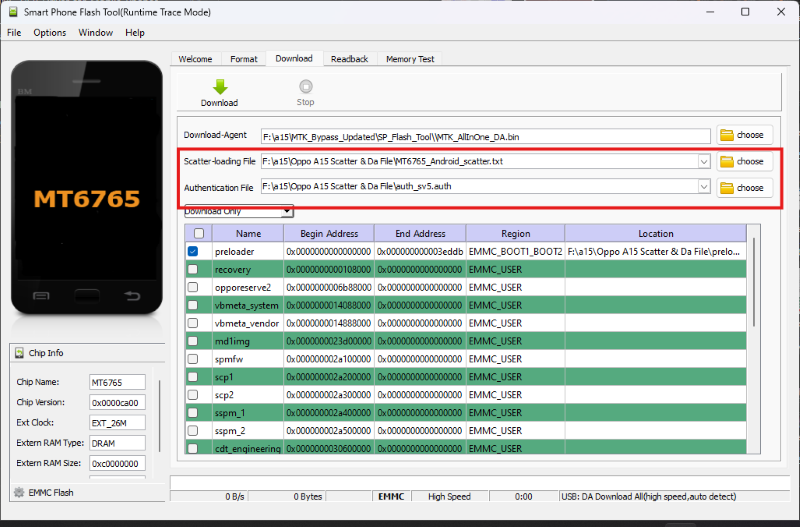
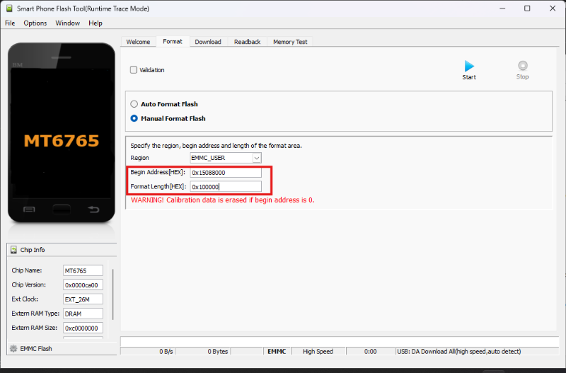
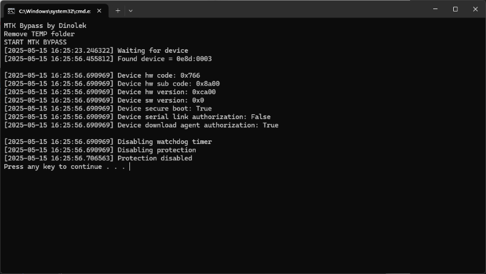

# Bypassing FRP on Oppo A15 (SP Flash Tool+MTK Bypass)

 

> [!WARNING]
> **Disclaimer:** Use these steps only on devices you own. Unauthorized bypassing of security features is illegal.

## 1. Preparation
1. Download these files:
   - [Oppo A15 Scatter & DA file](./Oppo%20A15%20Scatter%20&%20DA%20file.zip)
   - [MTK_Bypass_Updated.zip](https://m929.ru/_files/MTK_Bypass_Updated.zip)  
   - [UsbDk_1.0.22_x64.msi](https://github.com/daynix/UsbDk/releases/download/v1.00-22/UsbDk_1.0.22_x64.msi)  
2. Extract **MTK_Bypass_Updated.zip**.  
3. Prepare MTK Bypass. See the ["How to properly prepare the MTK Bypass Windows tool
" ](https://www.youtube.com/watch?v=QUcDoT4nfCU) video.  
4. Run **Install Drivers.bat** in `MTK_Bypass_Updater/Driver`.  
5. Install **UsbDk_1.0.22_x64.msi**. 
7. Install Python. 
8. Reboot your PC.  

## 2. Clearing User Data
1. Open **SP Flash Tool** from `MTK_Bypass_Updater/SP_Flash_Tool`.  
2. Load:
   - Scatter file: `MT6765_Android_scatter.txt`  
   - Auth file: `auth_sv5.atuh`  
   
3. Go to **Format > Manual Format Flash** and enter:
   - **Begin Address:** `0x263000000`  
   - **Format Length:** `0x300000000`  
   
4. Click **Start**.  
5. Run **broom.bat** in `MTK_Bypass_Updater/Bypass`.  
6. Hold **Volume+** and **Volume–** while connecting the USB cable.  You should get "Protection disabled" at the end.  
   
7. Wait for the green checkmark.  
   
8. Unplug the USB cable.  

## 3. Clearing FRP Partition
1. Repeat steps in [section 2](#2-clearing-user-data), but enter this values instead:
   - **Begin Address:** `0x15088000`  
   - **Format Length:** `0x100000`  
2. Wait for the green checkmark.  
3. Turn on the phone.  

> [!NOTE]
> Tested on Oppo A15 CPH2185 (15 May 2025)