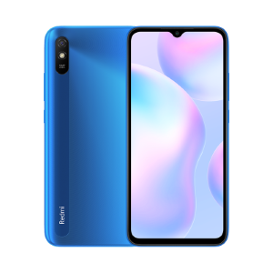

# Bypassing FRP on Redmi 9A

 

> [!WARNING]
> **Disclaimer:** Use these steps only on devices you own. Unauthorized bypassing of security features is illegal.

# Preparation
- SD Card
- Second Phone or Computer + SDCard reader
- [QuickShortcutMaker](https://www.apkmirror.com/apk/sika524/quickshortcutmaker/quickshortcutmaker-2-4-0-release/quickshortcutmaker-2-4-0-android-apk-download/) APK

# Step by Step

1. Copy the **QuickShortcutMaker** APK onto a microSD card, then insert the card into the phone.
2. Power on and connect to a Wi‑Fi network.
3. Tap **Add network**. In the “Network SSID” field, type any random text, long‑press to highlight it, then tap **Share** → **Notes**.
4. In the Notes app, tap **Share** again, choose **As image**, then select **Save to…**
5. The Gallery will open. Take a photo (any picture), then open its Details/Properties and tap the shown file path.
6. This launches the File Manager. Browse to the SD card location where you placed the **QuickShortcutMaker** APK and tap it to install. After installation, tap **Open**.
7. In **QuickShortcutMaker**, search for “Settings,” tap the Settings entry, then tap **Try**.
8. Once Settings opens, go to **Security** and set up a new Lock Screen (PIN, pattern, or password).
9. Reboot the device. After reboot, complete the initial setup (language, Wi‑Fi, etc.). When prompted for Google account, it will now ask for the lock screen you just created—enter it, and the phone will finish activation.

> [!NOTE]
> Tested on Redmi 9A (31 May 2025)
